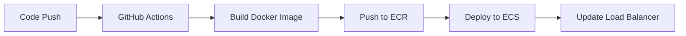

This is a [Next.js](https://nextjs.org) project bootstrapped with [`create-next-app`](https://nextjs.org/docs/app/api-reference/cli/create-next-app).

# Cordex Site

## Tech Stack

- **Frontend Framework**: Next.js 15.3.0
- **Language**: TypeScript
- **Styling**: TailwindCSS
- **Containerization**: Docker
- **Deployment**: AWS ECS (Elastic Container Service) with Fargate
- **CI/CD**: GitHub Actions

## Deployment Architecture

The application is deployed on AWS using a modern container-based architecture:

- **Container Registry**: Amazon ECR stores Docker images
- **Compute**: AWS ECS Fargate runs containers without managing servers
- **Networking**: Application Load Balancer routes traffic to containers
- **Logging**: CloudWatch collects application logs

## Continuous Integration & Deployment

This project uses GitHub Actions for automated deployment:



The workflow automatically:

1. Builds a Docker image of the application
2. Pushes it to Amazon ECR
3. Updates the ECS task definition with the new image
4. Deploys the updated service
5. Waits for the deployment to stabilize

Security is managed through GitHub OIDC, eliminating the need for storing AWS credentials in GitHub.

## Getting Started

First, run the development server:

```bash
npm run dev
# or
yarn dev
# or
pnpm dev
# or
bun dev
```

Open [http://localhost:3000](http://localhost:3000) with your browser to see the result.

You can start editing the page by modifying `app/page.tsx`. The page auto-updates as you edit the file.

This project uses [`next/font`](https://nextjs.org/docs/app/building-your-application/optimizing/fonts) to automatically optimize and load [Geist](https://vercel.com/font), a new font family for Vercel.

## Learn More

To learn more about Next.js, take a look at the following resources:

- [Next.js Documentation](https://nextjs.org/docs) - learn about Next.js features and API.
- [Learn Next.js](https://nextjs.org/learn) - an interactive Next.js tutorial.

You can check out [the Next.js GitHub repository](https://github.com/vercel/next.js) - your feedback and contributions are welcome!
